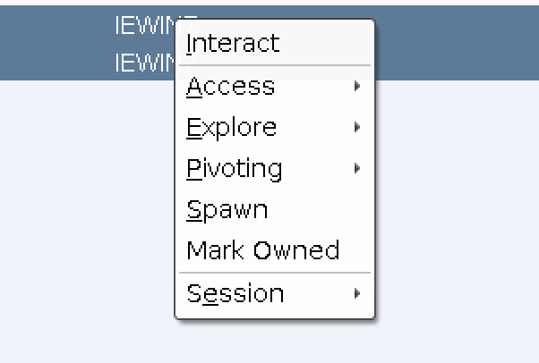
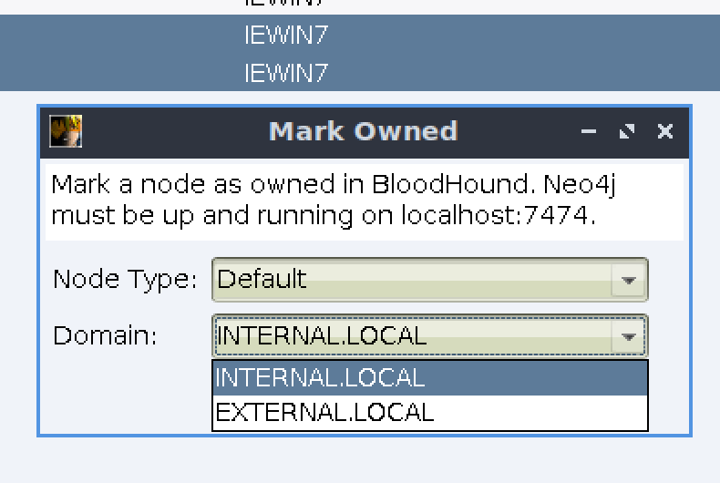

# Vampire

__Vampire__ (tentative) is an aggressor script which adds a "Mark Owned" right click option to beacons. This allows you to select either the Computer or User (or Default, which will choose based on your user), along with the domain they belong to. Vampire will communicate with your neo4j REST API on localhost:7474 to mark the node as owned.

How to use
---

 0. Put `vampire.cna` and `owned_utils.py` in the root of your cobaltstrike folder
 1. Load `vampire.cna` into Cobalt Strike
 1. Rain shells
 2. Start neo4j and BloodHound as normal
 2. Run BloodHound data collection and import data
 3. Right click your beacon(s) and mark them as owned
 4. ???
 5. Profit

Considerations
---

 - neo4j must be running on localhost, on the standard port - 7474
 - Your neo4j database creds should be Kali standard `neo4j:BloodHound` (you can change the base64 in owned_utils.py otherwise)

Benefits
---

 - Never miss an attack path
 - Quickly keep up with other team members' movement

Future Plans
---

 - Mark users as owned using the credentials callback

How it works
---

 0. Use `owned_utils.py` to query the list of domains from neo4j
 1. Obtain user selection
 2. Foreach selected beacon ID:
 3. Append `@` + the specified domain to the user/computer name
 4. For `Default`, it will choose based on whether you're a local admin
 4. Use `owned_utils.py` to query the neo4j REST API
    - `"MATCH (n:" + nodetype + " {name:'" + nodelabel + "'}) SET n.owned=TRUE"`